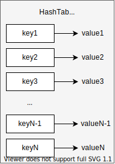
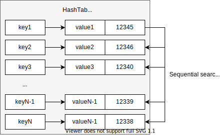
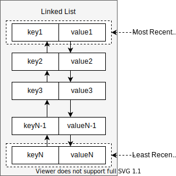
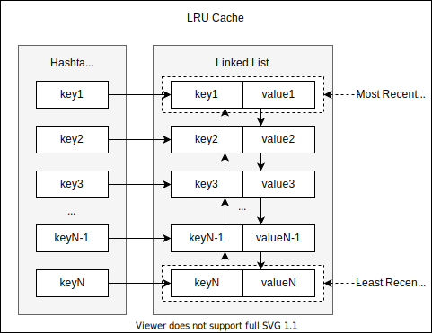

While preparing for coding interviews, I went through a large number of algorithmic challenges. I found particularly interesting one subset of problems - challenges related to designing some tools that we all use and rarely stop and think about how they work.

In this article, we are going to take a look at the Least Recently Used (LRU) cache.

**Least Recently Used Cache** is a key-value storage that has some capacity and a specific key eviction policy. Whenever it's specified in Gb, percentage of RAM or number of keys, the cache capacity is useful to prevent the storage from overflowing the available memory resources and shutting down unexpectedly.

But what can we do when we are about to reach our capacity limits?

This is where eviction is helpful. In the case of LRU policy, we can just **remove key-values that were not accessed for the longest time** a.k.a least-recently-used items. This is a pretty natural things to do and it's commonly used in such popular key-value storages as Redis.

Another part to pay attention to is cache. **Cache** is a kind of storage that is usually **optimized for reading and retrieving information** that would be time- or resource-consuming to calculate or collect without the cache.

## Problem Framing

Now we have a broad context around LRU cache use cases and we are ready to formulate the challenge.

We want to design a **class that represents LRU cache and has the following APIs**:

- `LRUCache(capacity: int)` class should be initialized with a capacity of the storage where the capacity is simply a number of keys that storage can hold.
- `get(key: int)` method which can retrieve the value by key in constant time (O(1)).
- `put(key: int, value: int)` method which stores key-value pair in the cache in constant time (O(1)). If a key is already in the storage, we need to replace its value with a new one. `put()` method should be constrained by capacity value and should not exceed it. When capacity restriction is about to be reached, we need to evict the least-recently-used item to put a new key-value pair to the storage.

Since we are trying to design a cache storage, pretty much every operation should be done in **constant time execution on average** to keep it practically useful. This means that key eviction should also happen in O(1) complexity range.

## Brainstorm Solutions

When I think about cache, **dictionaries or hashmaps** come to my mind.



<div class="image-title">Cache based on a hashmap</div>

Hashmaps allow to **read and write key-value pairs in constant time with high probability**.

The problem with dictionaries is that they usually don't guarantee order in which they manage keys. So we don't have a way to quickly remove least-recently-used items. We could introduce a notion of last-used timestamps for each item in the hashmap and update these timestamps during accessing the keys in `get()` method.



<div class="image-title">Timestamps won't help us because of sequential search we need to do on the hashmap</div>

However, it would still **take us O(n) in order to find items to evict** by timestamps. It's too time-consuming to meet our requirements.

Let's not get hung up on hashmaps. The problem with tracking item usage can be solved with **linked lists**.



<div class="image-title">Cache based a linked list</div>

With linked lists, we could **keep track of item usages in constant time**. We could simply move the item we currently access to the top of the list. In a natural way, **least used items end up being at the very bottom of the list** and we would get a list ordered by item usage as we go. Since we need to relink our items, it would be helpful to have reference to the previous and next items on the list.

Nevertheless, linked lists don't meet our requirements completely. It would **take us O(n) in order to find and retrieve item by key**. This is a sad complexity for cache storages.

To sum up, hashmaps luck the advantages of linked lists and linked lists luck advantages of hashmaps. We find to **find a way to combine hashmaps and linked lists** such that we meet our LRU cache requirements.

## Design Solution

After a little bit of thinking, it may click that we can **map our keys not to the values directly, but to the linked list nodes** that represent these values. Mapping keys to list nodes means that the **dictionary will hold node references** that don't depend on node positions in the list itself. So we would be able to **rearrange list items without a need to remap** them in the dictionary.



<div class="image-title">LRU cache architecture based on combination of hashmap and linked list</div>

## Implement Solution

Let's start our implementation from create APIs which we want to see in the linked list:

```python
from typing import Dict, Optional


class Node:
    """
    Linked List Node. Contains key-value pair and links to neighbor elements.
    """
    def __init__(self, key: int, value: int, prev=None, next=None):
        self.key: int = key
        self.value: int = value

        self.prev: Optional[Node] = prev
        self.next: Optional[Node] = next


class LinkedList:
    """
    Linked List. Represents usage history of cache items
    """
    head: Optional[Node] = None
    tail: Optional[Node] = None

    def add_to_head(self, item: Node) -> None:
        """
        Add node to the very top of the list
        """
        if self.head is not None:
            item.next = self.head
            self.head.prev = item

        if self.tail is None:
            self.tail = item

        self.head = item

    def unlink(self, item: Node) -> None:
        """
        Remove references to the node from other nodes on the list
        """
        if item is None:
            return

        prev_item: Node = item.prev
        next_item: Node = item.next

        # unlink the item node:
        # link prev and next items
        # removing referenced to the current item node
        if prev_item is not None:
            prev_item.next = next_item

        if next_item is not None:
            next_item.prev = prev_item

        if self.head == item:
            # item was the first element in the list
            self.head = next_item

        if self.tail == item:
            # item was the last element in the list
            self.tail = prev_item

        # make sure that the item itself doesn't have references to other nodes
        item.prev = None
        item.next = None
```

All node manipulations (e.g. `add_to_head()`, `unlink()` methods) operates in constant time and doesn't depend on the size of the linked list.

Having a linked list implemented, we can actually code the idea of LRU architecture we came up with:

```python
class LRUCache:
    """
    Implementation of cache storage with LRU eviction policy
    """
    capacity: int
    cache_map: Dict[int, Node]
    history: LinkedList

    def __init__(self, capacity: int):
        self.capacity = capacity
        self.cache_map = {}
        self.history = LinkedList()

    def get(self, key: int) -> int:
        """
        Retrieve value by its key or -1 otherwise
        """
        if key not in self.cache_map:
            return -1

        value_node: Node = self.cache_map[key]

        if self.history.head != value_node:
            # make item the most recently used
            self.history.unlink(value_node)
            self.history.add_to_head(value_node)

        return value_node.value

    def put(self, key: int, value: int) -> None:
        """
        Add a new key-value pair to the cache.
        If key exists, replace its value by a new one.
        If capacity is reached, evict the LRU item and insert a new pair
        """
        value_node: Node = Node(key, value)

        if key in self.cache_map:
            self.remove_item(self.cache_map[key])

        if len(self.cache_map) >= self.capacity:
            # no space left, needs to evict the least recently used item
            self.evict_least_recent_item()

        self.history.add_to_head(value_node)
        self.cache_map[key] = value_node

    def evict_least_recent_item(self) -> None:
        """
        Evict the least recently used item
        """
        lru_item: Node = self.history.tail

        if lru_item is None:
            return

        self.remove_item(lru_item)

    def remove_item(self, item: Node) -> None:
        """
        Remove item represented by node from the map and the list
        """
        self.history.unlink(item)

        del self.cache_map[item.key]
        del item

```

The `get()` and `put()` methods only rely on methods that run in constant time, so our implementation has **constant running time on average**.
Just like we have required earlier. In order to get here, we consume `O(2N)` memory to build a map and a linked list.

This solution is common and can be implemented in any general purpose language.
Specifically speaking about Python, it provides `OrderedDict` data structure that helps to implement LRU cache in a much **more concise way**.
Let's take a look:

```python
from collections import OrderedDict


class LRUCache:
    """
    This is alternative implementation of LRU cache based on OrderedDict
    """
    capacity: int
    cache_map: OrderedDict

    def __init__(self, capacity: int):
        self.capacity = capacity
        self.cache_map = OrderedDict()

    def get(self, key: int) -> int:
        if key not in self.cache_map:
            return -1

        value = self.cache_map[key]
        self.cache_map.move_to_end(key)

        return value

    def put(self, key: int, value: int) -> None:
        if key in self.cache_map:
            self.cache_map[key] = value
            self.cache_map.move_to_end(key)
            return

        if len(self.cache_map) >= self.capacity:
            lru_key = next(iter(self.cache_map))
            del self.cache_map[lru_key]

        self.cache_map[key] = value
```

OrderedDict seems to be introduced specifically to implement [LRU cache](https://docs.python.org/3/library/collections.html#ordereddict-examples-and-recipes).

<aside class="admonition note">
    <p class="admonition-title">Note</p>
    <p class="admonition-body">
        OrderedDict is not exactly the same as the dict class. 
        Dict is fully implemented on the interpreter level. It does preserve the order of inserted keys, but doesn't expose the move_to_end() method.
        OrderedDict is partially implemented on the Python level (as dict and a linked list), so it incurs some memory overhead.
    </p>
</aside>

## Summary

We went through designing and implementing our own LRU cache. We combined the advantages of hashtables and linked list and built efficient cache storage on top of them.

Besides being an interesting task, the problem is a common question in the coding interviews. So if you are preparing right now, feel free to implement LRU cache yourself on Leetcode.

## References

- <a target="_blank" rel="noopener" href="https://github.com/roma-glushko/leetcode-solutions/blob/master/src/design/lru_cache.py">Implementation on GitHub</a>
- <a target="_blank" rel="noopener" href="https://leetcode.com/problems/lru-cache/">[LeetCode] 146. LRU Cache</a>
- <a target="_blank" rel="noopener" href="https://www.amazon.com/Cracking-Coding-Interview-Programming-Questions/dp/0984782850">Cracking the Coding Interview book by Gayle MacDowell</a>
