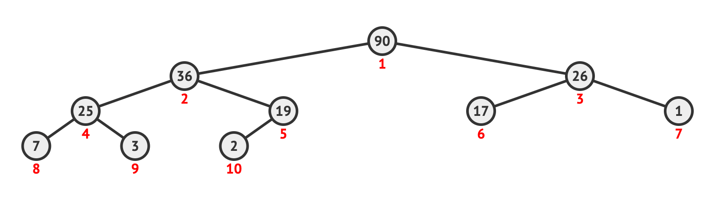

When you have a sequence of candidates to process, then you build a queue to organize them. In the classical queue, time of adding an item to the queue defines when it's going to be processed.

What if we need to change this principle and use some **relative importance score** to determine the item processing sequence?

Well, then we would reinvent ~~bicycle~~ the priority queue.

<div style="width:100%;height:0;padding-bottom:76%;position:relative;"><iframe src="https://giphy.com/embed/3orif1K6QR54NlWzLO" width="100%" height="100%" style="position:absolute" frameBorder="0" class="giphy-embed" allowFullScreen></iframe></div><p><a href="https://giphy.com/gifs/thesimpsons-the-simpsons-6x25-3orif1K6QR54NlWzLO"></a></p>

**The priority Queue or Heap** is a data structure that efficiently allows to retrieve the next queued item with min or max importance score.

## Nearly Complete Binary Tree

The heap can be represented as an array or a list that is visualized as a nearly complete binary tree:


<div class="image-title">Max Heap</div>

Since it's a binary tree, **all parent nodes** have **at max 2 children**. The binary tree is filled level by level from top to bottom, from left incomplete parent nodes (with none or one child) to right ones.

With such a node positioning, we can come up with formulas for finding parent/children nodes:

- $element\_idx / 2$ is the node parent index
- $2 * element\_idx$ is an index of left child
- $2 * element\_idx + 1$ is an index of right child

where $element\_idx$ is some node index.

Additionally, the binary tree has the following useful properties:

- Heigh of the tree is $ln(N) + 1$

The "nearly complete" means that **not all tree levels** may be **filled out** by leaf nodes (nodes without children). In other words, we can have a heap with any number of items.

The heap has a distinct property that actually makes it helpful:

- all children node values should be **less or equal** to the parent node value (**the max heap property**)
- or all children node values should be **greater or equal** to the parent node value (**the min heap property**)

To explain how all of this can be useful, we are going to implement the main heap functions from scratch.
## Heap Building

There is going to be a custom `PriorityQueue` class which takes an arbitrary array of integers, make a heap from it and sustain the heap property during all operations.

The first thing we need to do is to build a max heap from an unsorted array. We can already visualize the array as a heap, but it would **luck the max heap property**.

Notice that **leaf nodes can't violate the heap property** since they don't have any child nodes. Hence, we can start looking at possible violations from the second-to-last level. The index of last parent element on that level we can get via `n // 2` where `n` is a size of the array.

We start moving from right to left, from the bottom to the top of the heap. For each parent node, we need to make sure that the property of the heap holds true. If there is any violations, we just switch the current parent node with a child node that is greater than it (which violates the heap property).

However, this switching of the nodes may create a new violation on the levels below. So we need to perform the same procedure again for a node that became a child.

`video: title: "Building a heap": ./img/heapify.mp4`
<div class="image-title">Max Heapifying</div>

Here is how this can be implemented:

```python
from typing import List


class PriorityQueue:

    def __init__(self, items: List[int]):
        self.items = self.build_heap(items)

    def build_heap(self, items: List[int]) -> List[int]:
        n = len(items)

        for i in range(n // 2, -1, -1):
            items = self.heapify(items, i)

        return items

    def heapify(self, items: List[int], node_idx: int) -> List[int]:
        n = len(items)
        largest_idx = node_idx

        # formulas for zero-indexed arrays
        left_child_idx = 2 * node_idx + 1
        right_child_idx = 2 * node_idx + 2

        if left_child_idx < n and items[left_child_idx] > items[largest_idx]:
            largest_idx = left_child_idx

        if right_child_idx < n and items[right_child_idx] > items[largest_idx]:
            largest_idx = right_child_idx

        if largest_idx != node_idx:
            tmp = items[node_idx]
            items[node_idx] = items[largest_idx]
            items[largest_idx] = tmp

            return self.heapify(items, largest_idx)

        return items

    def size(self) -> int:
        return len(self.items)
```

Complexity of this algorithm is $\Theta(n log(n))$.

## Adding a New Element

Another useful method to have is adding a new item to the heap. In this case, it's convenient to add a new item as a leaf node in the end of the heap array. This makes sure there is no violations below it. However, there may be some going upward. That's why we need to go all the way up and check whenever parent nodes are greater than the new item. If they are not, we will switch their positions.

Since the max heap property had stayed true before we add the new item, it's sufficient for us to check only parent nodes as we know that all child nodes should be less or equal to the parent value. 

`video: title: "Insert a new item to the heap": ./img/insert-a-new-item-to-the-heap.mp4`
<div class="image-title">Insert a new item to the heap</div>

Now we can take a look at the implementation:

```python
def push(self, item: int):
    self.items.append(item)

    idx = len(self.items) - 1
    parent_idx = idx // 2

    if idx % 2 == 0:
        # calculating parents in zero-indexed array
        parent_idx -= 1

    while idx > 0 and self.items[idx] > self.items[parent_idx]:
        tmp = self.items[parent_idx]
        self.items[parent_idx] = self.items[idx]
        self.items[idx] = tmp

        idx = parent_idx
        parent_idx = idx // 2

        if idx % 2 == 0:
            # calculating parents in zero-indexed array
            parent_idx -= 1
```

Complexity of heap inserting algorithm is $\Theta(log(n))$ since at each interactions we traversal another tree level.

## Extracting The Max Element

The key method of the heap is extracting the max element. Because of the heap property, the max element should always stay that the top of the heap. So it's as simple as call `self.items[0]` to get it.

That's not all. The extraction would remove the element from the heap and we can not just leave it with a "hole". Instead, we need to put the next max element there.

Like before, the safest way is to **replace the hole with the last leaf node** (not to change the heap property in other branches of the heap). The last item is just handy to use, but it's not necessarily the next needed candidate to be at the top of the heap. To make sure, we need to run the `heapify()` method which recursively fixes all violations.

`video: title: "Extract the max element from the heap": ./img/extract-max-element-from-the-heap.mp4`
<div class="image-title">Extract the max element from the heap</div>

The implementation is straightforward:

```python
def pop(self):
    item = self.items[0]

    n = len(self.items)
    self.items[0] = self.items[n - 1]  # replace extracted max element with one of the balanced leaves
    del self.items[n - 1]

    self.items = self.heapify(self.items, 0)

    return item
```

Complexity of heap items extracting algorithm is $\Theta(log(n))$. Nevertheless, we can get an access to the current max element in $\Theta(1)$.

## Heap Sort

Now we have all components to implement one of the most frequent applications of the priority queue - the heap sorting.

Heap sort is just extraction of `n` elements from the heap.


`video: title: "Heap Sort In Action": ./img/heap-sort.mp4`
<div class="image-title">Heap Sort In Action</div>

This is how it looks like in Python:

```python
def heap_sort(heap: PriorityQueue) -> List[int]:
    n = len(heap.size())
    
    result = []

    for i in range(n):
        result.append(heap.pop())

    return result
```

TODO: add info about complexity and memory requirements

## Applications

Heap sorting is not the only application of the priority queue. Here are a few more cases where heaps are being applied:

- access to a limited resource like making sure your Zoom application has a high network bandwidth priority, hence, lower latency
- device interruption handling like pressing a key on the keyboard triggers a specific interruption handler that rads a key value and send it to the OS. There is an interruption latency associated with this process and interruptions from some devices we wish to be processed as soon as possible
- the heap can be used during searching for <a target="_blank" rel="noopener nofollow" href="/blog/k-nearest-neighbors/">K-Nearest Neighbors</a>

Broadly speaking, the heap may be used everywhere where we need to keep track of the list of min or max elements which may be changed during the runtime.

## heapq

Thankfully, it's not required to implement the heap yourself everytime you need it. Python provides a library called <a target="_blank" rel="noopener nofollow" href="https://docs.python.org/3/library/heapq.html">heapq</a> which is a set of functions that operates on the "heapified" array preserving the min heap property.

TODO: add usage

## Practice

- <a target="_blank" rel="noopener" href="https://leetcode.com/problems/last-stone-weight/">[Leetcode] 1046. Last Stone Weight</a>
TODO: add 2 more tasks

## Conclusions

TBU

## References

- <a target="_blank" rel="noopener nofollow" href="https://ocw.mit.edu/courses/electrical-engineering-and-computer-science/6-006-introduction-to-algorithms-fall-2011/lecture-videos/lecture-4-heaps-and-heap-sort/">MIT 6.006 - Heaps and Heap Sort</a>
- <a target="_blank" rel="noopener nofollow" href="https://visualgo.net/en/heap">Heap Visualized</a>