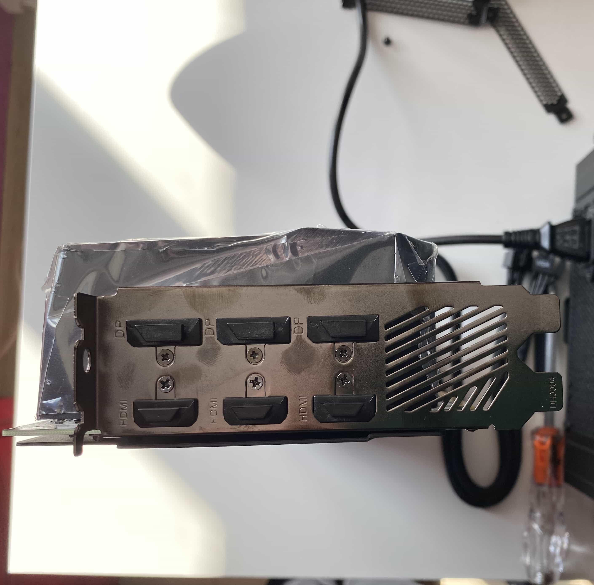

Kaggle Kernels and Google Colab are great.

<iframe src="https://giphy.com/embed/UmBdALbYTmCJ2" width="100%" height="100%" style="position:absolute" frameBorder="0" class="giphy-embed" allowFullScreen></iframe>

I would drop my mic at this point if this article was not be about building a custom ML workstation.

There are always some "buts" that makes our lives harder. When you start to approach nearly real life problems and see hundreds of gigabytes large datasets, your gut feeling starts to tell you that your CPU or AMD GPU devices are not going to be enough to do meaningful things. This is how I came here.

I was taking part in <a href="https://www.kaggle.com/c/hpa-single-cell-image-classification">Human Protein Atlas (HPA) - Single Cell Classification</a> competition on Kaggle. HPA dataset contains nearly 150Gb of 8bits 4-channels protein images. 16bits variant of the dataset holds 350Gb.

Here is what I had at my disposal:

- MacBook Pro 2019 (Intel Core i9 && Intel UHD Graphics 630 1536MB && 16GB DDR4)
- ~30h GPU and/or ~30h TPU hours per week on Kaggle Kernels

Sounds good. I though I would be able to prototype locally and then execute notebooks on the cloud GPU. What could go wrong?

## Life Without GPU

As it turned out, there are a lot of frictions in the mentioned workflow.

First of all, my solution source code quickly became an entire project with a lot of source code and dependencies. I used <a href="https://python-poetry.org/">poetry</a> as a package manager and decided to generate an installable package every time I made meaningful changes to the project in order to test them in the cloud. These installable packages I was uploading into a private Kaggle dataset which in turn was mounted to a notebook. The notebook was calling classes and functions from the package.

This approach to bring a full-size project turns out to have underwater stones. Kaggle notebooks randomly thrown weird errors after installing project packages. I think it was related to dependency version mismatch and I spotted errors like "method X is not found in package Y", etc. Autoreload was not helpful. Several mornings in a row I started my day dealing with new and new suddenly occurred unearthly issues.

<iframe src="https://giphy.com/embed/l2YWmG9FBDtiqHTi0" width="100%" height="100%" style="position:absolute" frameBorder="0" class="giphy-embed" allowFullScreen></iframe>

While working on the competition, I switched from Keras to PyTorch. PyTorch is much slower on CPU then TensorFlow or Keras. It was time consuming to even perform a dev run of my recent changes. However, PyTorch has outstanding support in academic and other ML-associated communities which means a bunch of (**almost**) read-to-use examples of state-of-art technics.

Also, when you run your code in the cloud, you can not easily experiment. You have to plan what you are going to experiment with and make that part somehow configurable.

All in all, the experience was frustrating. I clearly realized if I wanted to do more complex deep learning experiments and projects, then I just need to have 24/7 access to any kind of GPUs.

## Investigation

I have never been interested in custom PC building, hardware or gaming. So it took me a while to understand what did it cost me to build a custom machine.

<iframe src="https://giphy.com/embed/kxkmUjgUwzhk7uIxOA" width="100%" height="100%" style="position:absolute" frameBorder="0" class="giphy-embed" allowFullScreen></iframe>

There are a lot of resources on building gaming PCs. While building a deep learning workstation sounds like a similar task, there are nuances that should be accounted in order to build a cost-efficient and ML-compatible machine.

I have found a few useful blog posts which helped me to quickly grasp the topic. Particularly, I could highlight two posts from <a target="_blank" rel="noopener" href="https://twitter.com/Tim_Dettmers">Tim Dettmers</a>:

- <a target="_blank" rel="noopener" href="https://timdettmers.com/2018/12/16/deep-learning-hardware-guide/">A Full Hardware Guide to Deep Learning</a>
- <a target="_blank" rel="noopener" href="https://timdettmers.com/2020/09/07/which-gpu-for-deep-learning/">Which GPU(s) to Get for Deep Learning: My Experience and Advice for Using GPUs in Deep Learning</a>

In his blog, Tim explained at length importance of each PC part for ML workstation and provides general pieces of advice on choosing them. Here I'm going to mention information that was helpful for me along with details Tim did not focus on.

Also, <a target="_blank" rel="noopener" href="https://pcpartpicker.com">PCPartsPicker's Builder</a> was super helpful during planning PC. It suggested possible components compatibilities and things to check before ordering the list. It helped to overcome my constant fear that I could buy something that would not work together.

## Parts for ML build

When it comes to building a deep learning machine (or any custom PC), there are 8 parts that should be considered:

- <a href="#gpu">GPU</a>
- <a href="#motherboard">Motherboard (a.k.a. MoBo)</a>
- <a href="#cpu">CPU</a>
- <a href="#ram">RAM</a>
- <a href="#storage">Storage</a>
- <a href="#power-system-unit">Power System Unit (PSU)</a>
- <a href="#cooling">Cooling</a>
- <a href="#pc-case">PC case</a>

Here is an overview:

### GPU

GPU is **the key component** of any ML workstation. It's designed to perform computations on **big chunks of data** (throughput-optimized) **in parallel** which makes it perfect for model training or inference where it's really needed (<a target="_blank" rel="noopener" href="https://www.quora.com/Why-are-GPUs-well-suited-to-deep-learning/answer/Tim-Dettmers-1" title="Why GPU is faster then CPU?">here is details</a>).

The very fist consideration is that we need **NVIDIA graphic cards only** for deep learning. Unfortunately, there is a monopoly in ML framework world. Most of the popular and production-ready frameworks (TensorFlow, PyTorch, Keras) are designed and optimized for CUDA-enabled devices. CUDA is a proprietary platform and set of APIs for parallel computations owned by NVIDIA. This is the reason why we mean "CUDA cards" when talk about the GPU in ML context.

It makes sense to dig just slightly deeper in a simplified CUDA architecture. Modern GPUs are based on **tensor cores** that are capable of multiplying **4x4 matrices in one operation** which is blazing fast. Despite that, tensor cores need data to perform computations on. Data passes the following way in order to be loaded efficiently:

- **From CPU to Global GPU Memory**. CPU threads load preprocessed batches into entirely separate GPU device memory (don't be confused with PC RAM). The device memory is the slowest kind of memory in the GPU.
- **From Global GPU Memory to Shared Memory**. Shared memory is **~10-50x faster** then the global GPU memory, but it's also much smaller (normally hundreds of Kbs). This memory is purely available for a Streaming Multiprocessor (SM) that is an analogue of CPU core in GPU architecture. Data is stored there in so called tiles.
- **From Shared Memory to Tensor Core Registries**. Streaming Multiprocessors operates their tensor cores in parallel and upload part of the tiles into tensor core registries.

So any bottlenecks in data loading flow would lead to suboptimal utilization of tensor cores, no matter how many of them you have in your GPU.

CUDA Hardware Architecture (<a target="_blank" rel="noopener" href="https://dadaiscrazy.github.io/usuba/2020/03/28/CUDA-basics.html" title="source of the image">source</a>)

With that being said, these are roughly the main GPU features important for ML tasks:

- **Global GPU Memory** - defines how big batch sizes you can use during training or how quality samples you can use if it comes to computer vision
- **Memory Bandwidth** - a rate at which data is being transferred inside of the device
- **Architecture** - the more recent architecture is the better. Newer architectures may be better in terms of shared memory size, feature set (like mixed precision computations) and could be more efficient in terms of wattage per effective computations metric.

Additionally, you should think about these factors:

- **Performance per Cost**
- **GPU Cooling**
- **GPU Wattage**

Thankfully, you can find much more on that in the <a target="_blank" rel="noopener" href="https://timdettmers.com/2020/09/07/which-gpu-for-deep-learning/">Tim's post</a>.

### Motherboard

Motherboard integrates most of the components and also provides:

- most of the I/O ports (like USB, Ethernet, etc)
- chipset with BIOS
- WiFi, Bluetooth adapters

Motherboard provides other interfaces to power your stuff. Among them, the one of most important is CPU. The motherboards are divided into AMD- and Intel-compatible sockets which are not interchangable. Hence, you need to make sure **CPU of you choice** is **compatible with your motherboard**.

**Number of PCI ports** is another thing to consider. Since PCI ports are used to connect GPUs, you need to plan ahead your build and rooms for upgrades (to be able to add more cards in the future, for example). Also, pay attention that, effectively, graphic cards takes more then slot of space. We want to have **as much space as possible** between cards for **better air cooling**.

Also, I'm pretty sure you would be happy to have build-in WiFi adapter. Otherwise, the only way to connect a PC would be via ethernet cable which is not alway convenient (or just buy an external adapter).

### CPU

CPU is the "right hand" of GPU. In ML builds, CPU is used for:

- **Preprocessing Dataset**
- **Loading batches into RAM**
- **Transmitting batches from RAM to the GPU global memory**
- **Running functions in GPU device**

So it's not really helpful to have high CPU frequency. Nonetheless, it's important to be able effectively execute small tasks in parallel. Other words, number of **threads and cores** are important property for ML machines.  

### RAM

When it comes to RAM, the **memory capacity** is all that matters. It's perfect to have enough RAM to run model training without falling back to **swapping**. Larger capacity would allow to run bigger batches of data and execute more data loaders to make GPU wait less.

 RAM is also helpful during **data processing and feature engineering**. Hence, the larger RAM you would have, the better would be for you. 

### Storage

In deep learning, storage is used for **persisting datasets**. Since nowadays datasets are measured in gigabytes, it's good to have at least **a few terabytes** of free disk space. Generally, people install the SSD for OS needs and datasets which is currently in use. The HDD is still helpful, because it's cheaper then the SSD and it's easier to afford terabytes of space for storing other datasets.

Amoung SSDs, you could find <a target="_blank" rel="noopener" href="https://www.microcontrollertips.com/why-nvme-ssds-are-faster-than-sata-ssds/">NVMe SSDs</a> on the market which use faster connection protocol. Prefer these kind of SSD if you can afford them.

### Power System Unit

The PSU is what makes your PC alive. To choose your PSU, you need to calculate **wattage consumption** of your build. Typically there are two the most power consuming components: **CPU and GPUs**. If you sum up their consumptions and adds another 10-15% on top of that (for other components, overclocking, etc), you would roughly estimates your power needs. I also use <a target="_blank" rel="noopener" href="https://pcpartpicker.com">PCPartpicker Builder</a> to estimate PC wattage.

Other then that, you should consider number of **slots and connectors** that the PSU provides. 

This is the point where you can plan ahead. Just include potential GPUs you would like to buy in the future to the wattage consumption and connectors consideration.

### Cooling

With a great power comes a great ~~responsibility~~ need for cooling.

Normally, you would need **an air cooling**. Making sure there is **enough space between GPUs** is a great no-overhead way to cool your system. It's particularly good in 1-2 GPUs setup. **A water cooling** is a good option for 3+ GPUs setups.

CPU could get hot very quickly. So they usually is sold with basic coolers. This should be enough if you manage to avoid lots of air bubbles during the thermal gel installation. If you want to replace a stock cooler with better one, make sure that a new cooler supports your CPU socket.

### PC Case

The computer case protects all components from the outside environment. Also, it may provide:

- **Additional system coolers**
- **Additional I/O ports** (USB, Type-C, etc)
- **Cable management**
- **Vertical slots for GPUs**
- **Slots for SATA disks**
- **Cool design and look** (well, that may matter)

One of the most important considerations is an **ability to hold** all your cooling systems and GPUs. If your case is too small, it may be problematic.

## My Parts List

Creating a multi-GPU cluster was not on my list. Yet still I wanted to have a room for improvements. So I took <a target="_blank" rel="noopener" href="https://pcpartpicker.com/user/tim_dettmers/saved/#view=mZ2rD3">2-GPUs barebone from Tim's templates</a> as a base for my workstation and adjusted it a bit to match what I could find on the local market. Here is my final list of components:

- GPU: <a target="_blank" rel="noopener" href="https://www.newegg.com/gigabyte-geforce-rtx-3070-gv-n3070aorus-m-8gd/p/N82E16814932359">Gigabyte GeForce RTX 3070 8Gb Aorus Master</a>
- Matherboard: <a target="_blank" rel="noopener" href="https://www.newegg.com/msi-performance-gaming-x470-gaming-plus-max/p/N82E16813144266">MSI x470 Gaming Plus</a>
- CPU: <a target="_blank" rel="noopener" href="https://www.newegg.com/amd-ryzen-5-3600/p/N82E16819113569">AMD Ryzen 5 3600</a>
- RAM: <a target="_blank" rel="noopener" href="https://www.newegg.com/g-skill-32gb-288-pin-ddr4-sdram/p/N82E16820232091">G.Skill Ripjaws V Series 32Gb (2 x 16Gb)</a>
- Storage: <a target="_blank" rel="noopener" href="https://www.newegg.com/samsung-970-evo-plus-500gb/p/N82E16820147742">Samsung 970 Evo 500Gb M.2-2280 NVME</a>
- Cooling: <a target="_blank" rel="noopener" href="https://www.newegg.com/cooler-master-hyper-212-black-edition-rr-212s-20pk-r1/p/N82E16835103278">Cooler Master Hyper 212 Black Edition</a>
- PSU: <a target="_blank" rel="noopener" href="https://pcpartpicker.com/product/MfJwrH/evga-power-supply-220g20750xr">EVGA G2 750W 80+ Gold</a>
- PC Case: <a target="_blank" rel="noopener" href="https://www.newegg.com/matte-black-nzxt-h-series-h510-atx-mid-tower/p/N82E16811146315">NZXT H510</a>
- Wireless Adapter: <a target="_blank" rel="noopener" href="https://www.newegg.com/tp-link-archer-t2u-plus-usb-2-0/p/N82E16833704471">TP-Link Archer T2U Plus</a>

The same list on PCPartsPicker can be found <a target="_blank" rel="noopener" href="https://pcpartpicker.com/user/roman-glushko/saved/8gZHGX">here</a>.

A few notes about differences of my list comparing to the original barebone. I have replaced a PSU and a cooler from the barebone following advice from Reddit users that said that changed parts are more up-to-date and modern.

Also, I was able to buy only 750W version of EVGA G2. My estimated wattage is 420W, so 650W version should have been enough. Nevertheless, more capable PSU gives more flexibility in terms of further part updates.

Situation with GPU was much more complicated. It was the beginning of GPU shortage (end of 2020 - beginning of 2021) when GPU prices skyrocketed twice or sometimes three times. In that time, Bitcoin jumped to almost $60k as well as other factors that impacted supply chain and increased GPU demand (mostly, global COVID-19 lockdown).

GPU Price Dynamics: end of 2020 - beginning of 2021. Wild time

I had been closely watching for price updates for like 3 months. The situation did really changed. Well, it got even worse while I was waiting.

Considering Tim's advice and crazy GPU prices, I was shooting for RTX 3070. RTX 2080 Ti would be also a great fit, but the market ran out of them pretty quickly.

There turned out to be a lot of vendors that produce RTX 3070 cards.

[embed: Difference between graphic card vendors](https://www.youtube.com/embed/N3lfXsa08CY)

Difference between graphic card vendors

Basically, the main differences are in:

- **Max Power Limit** - affects GPU performance
- **Quality of the card cooling system** - ability to cold card and sustain performance for a long time
- **Fan Noise** - it's just annoying to run noisy cards (particularly if you working in t a place where other people work or live)

## Hardware Installation

It took me a couple of weeks to collect all parts.

PC parts arrived. I think I could build a new house with these boxes. Stay tuned for more updates on this

Before unboxing all of those packages, keep in mind the following:

- You need to **discharge static electricity** that may be on your hands. Static electricity can damage your components particularly your matherboard. Fortunately, it's easy to do. You need to periodically touch any metal object like your PC case, heater or filing cabinet. If you feel paranoid, there are a <a target="_blank" rel="noopener" href="https://www.newegg.com/rosewill-rtk-001/p/N82E16899261001">special wrist straps</a> for you.
- Be careful when you install or connect your components. Parts and cables are designed to be connected easily. If you find yourself **pressing too much**, chances are it's a signal to revisit what you are trying to connect and how. Exceptions happen since you probably would buy new things which have never been connected.

Now it's time to get our hands dirty!

### Motherboard

Motherboard is a central component. So I started unboxing from it.

Motherboard Unboxing

It has a lots of ports which we are going to be used further in this section.

Motherboard. Detailed View

The MoBo instruction is useful when you install components. Definitely take a look at it!

### CPU

Now let's unbox a CPU. The CPU box contained a CPU chip itself and a basic CPU cooler which actually holds most of the space in the box.

CPU Unboxing

We are going to install the CPU into the special CPU socket on the MoBo. It has AM4 format in my setup.

CPU Socket

Be super careful with CPU pins. They are very tangible. Notice that there is also a little golden arrow on one of the edges.

CPU Pins

It's there to guide on how to connect your CPU. There is **only one way** pins can be installed into the socket. It's when the golder arrow banded egde is in the bottom left corner of the CPU retention plate.

Push a retention lever down and outward to release the CPU retention plate and put your CPU in the mentioned way.

Installed CPU

Push the retention lever back to firmly install your CPU chip.

### SSD

NVMe SSDs are much smaller than their SATA friends. It's just a one little plane that sits in the box.

M.2 SSD Unboxing

To connect this kind of SSDs, you need to use the M.2 socket. My MoBo has two of them. Each of them is supplied with a pair of a screw and a mounting screw. The MoBo has a few mounting posts for SSDs of different lengths.

NVMe SSD Installation. M.2 Screw

Just pick a mounting post that corresponds to your SSD size, install there a mounting screw and fix the SSD with the remaining screw.

### RAM

RAM planks are easy to install as well.

RAM Unboxing

Unlock your RAM slots and align your RAM plank with the slot. There is **also only one way** the plank can be firmly installed.

RAM Installation

Notice that your MoBo instruction may specify recommended positions for different number of RAMs. Follow that recommendations!

### Cooler

People suggest to **avoid applying power** to CPU before installing its cooling system. CPU may overheat or become weaker.

My cooler is designed to work with both Intel and AMD CPUs. So the cooler box actually contains much more screws and other details then I needed in this particular build. This is the reason why its backpanel has such a bizarre form.

Cooler Unboxing

The first step to install the cooler is to uninstall the stock backpanel.

Uninstalling Stock CPU Backpanel

This backpanel is going to be replaced by one that is provided with your cooler. In my case, I had to assemble a backpanel in AMD-compatible way.

Cooler Backplate

Flip your board around and match match your new backpanel screws with the motherboard.

Cooler Backplate Installed

To finalize the backpanel installation, you need to install mounting screws on which the actual cooling system would be joined.

Next, you could assemble the cooler system. It's typically needed to attach cooler legs on which it should be screwed down to the backpanel. After assembling, try to match your mounting screws to make sure your cooler legs are installed correctly.

One of the final steps before you can attach your cooler is thermal paste installing. I have used the pee method explained in the video below.

[embed: How to use thermal paste?](https://www.youtube.com/embed/-hNgFNH7zhQ)

How to use thermal paste?

When using thermal gel, you need to cover CPU chip area as much as possible to allow better removal of CPU heat. Bubbles of airs that could pop up during this procedure would hurt.

Finally, you can attach your cooler on the top of the CPU. Press CPU a bit to distribute your thermal gel well on the surface.

In addition, make sure that gel stays on the CPU only as it may damaged your MoBo.

Finally, you can connect cooler power cable into the nearest port on the MoBo marked as CPU_FAN.

### PSU and Computer Case

A PSU box includes a power unit module and various cables.

Power Supply Unboxing

A computer case is just a metal box with two removable panels on the opposite sides of the box.

Computer case without glass panel

On the top side of the box you can see the front panel of the case. You can have a few more ports there as well as power buttons.

Computer case front panel

First of all, install main I/O ports cover that comes with your motherboard into your computer case. Surprisingly, it's important to make sure that all little latches on the sides of the cover are fully installed and visible on the flip side. Otherwise, they may prevent you from screwing your motherboard down.

Three little metal latches on the top side of I/O port cover 

Main I/O ports

Then, you can try to screw down your motherboard to the case mounting positions.

Next, there are three cables you need to connect in order to power your system:

- Motherboard power cable
- CPU power cable
- Front panel power cable

It's straightforward how to connect CPU and motherboard power cables. However, it may be challenging to connect front panel cables for the first time. The following video was helpful in my case:

[embed: How to connect the front panel power into JFP port?](https://www.youtube.com/embed/9--Nbg2qKUA)

How to connect the front panel power into JFP port?

There may be still a few remaining cables to connect to the MoBo. In my case, I had USB, audio and Type-C power cables. The first two I was able to connect while the last one required an adapter since my MoBo doesn't have Type-C ports. So I kept it disconnected. By the way, PCPartsPicker can warn you about such a issues in advanced.

Motherboard installed into the computer case

Additionally, you may need to connect coolers that come with your computer case.

At this point, you may try to apply power to your PC but you will get **no video signal** until you install your graphic card.

### GPU

The GPU box includes a card itself and an instruction.

RTX 3070 Graphic Card

My GPU holds two slots so I needed to match output covers to replace them with actual GPU I/O ports. 

Graphic Card Covers on the Computer Case

GPU ports are HDMI and DP with mocks to protected them from the dust. On the left side of the I/O steel plate you can see two teeth that helps to mount the graphic card. 

Make sure **use one of these ports to connect your monitor**. HDMI port on the motherboard may not work properly.

Ports on Graphic Card

The computer case has special slots for these teeth. If you find that **your GPU teeth cannot be installed**, you mostly likely have some issues with motherboard mounting. Try to remount your motherboard to match the slots.

Graphic Card Teeth Mounted

Gigabyte Aorus Master RTX 3070 requires two VGA cables to power it. Make sure your cables ends are firmly installed into the GPU and PSU. Otherwise, the GPU may be not found by motherboard.

Power applied to the graphic card

## Hardware Troubleshooting

If you put your first custom PC together, it's plausible that it's not going to work from the first try. In my case, the workstation simply did not turn on. There are a few things you want to double check before returning your parts back to your suppliers:

 - **The front panel power is connected correctly**. Get back to <a href="#how-to-install-front-panel-power-cables">the front panel power cable installation</a> and double check if you get them installed the right way. For instance, this was the reason why my PC did not work.
 - **RAM sticks are seated securely**. Try to reinstall your RAM sticks. RAM port mechanism should lock them down.
 - **Power supply cables are connected firmly**. Make sure your power cables are fully connected on the both sides. I had some issues with this as well. Each connector has a lock mechanism that should hold cables inside of ports. Check if all locks are installed.
 - **Motherboard is installed on the standoffs**. Some cases provides a special standoff screws on which motherboard should be installed. Standoffs elevates the motherboard and protects it from touching metal trays which may lead to the short out.

Another symptoms I want to review is **your PC turns on but shuts down after short time during booting**. In this case, there may be a faulty component that prevents your PC build from running. I found a good strategy to diagnose this:

- Try to unconnect all "unnecessary" components like second HDD or case coolers and double check whenever the issue is still in place.
- Keeps unconnecting things untill your issue is not there anymore.
- Last unconnected component is likely the reason of the issue. Try to connect it again to prove the assumption.

The following video shows the process of troubleshooting in action:

[embed: How to diagnose faulty PC components?](https://www.youtube.com/embed/QP6pAPctqbk)

How to diagnose faulty PC components?

Also, your motherboard may have debug LED which indicates what component of the system is not found. In this case, you need to double check that signaled component is getting power and installed correctly.

Finally, after some time you will be able to see a video signal on your screen and system that is looking for bootable device.

PC Boot and back side of the case with cable management sections

It's a good time to mount your PSU and take advantage of cable management system that your computer case provides. 

Mounted PSU

## Software Installation

I considered Ubuntu 20.10 and Windows10 + WSL2 setups. Linux setup is more stable and straightforward now. However, WSL2 sounds to be a pretty viable way to go as well. Tell you more about that next time.

I have only macOS at my hand, so I used <a target="_blank" rel="noopener" href="https://unetbootin.github.io/">UNetBootIn application</a> to burn a Linux bootable USB. I preferred to use <a target="_blank" rel="noopener" href="https://ubuntu.com/download/alternative-downloads">a BitTorrent</a> to download the Ubuntu 20.10 image.

Pay attention, that some Linux distributions (like Kali) complain that UNetBootIn **is not the most reliable way** to write a bootable USB. Fortunately, I seemed to have no issues with that. However, I had to buy a new USB stick as my old one seems to become faulty. Installation from the old USB stick failed because of the broken files every other time I had tried to install an OS.

After I got a new USB stick, I could able to install Ubuntu without issues.

### WiFi Adapter Drivers

Unfortunately, MSI X470 MAX Gaming Plus motherboard doesn't support WiFi out-of-the-box. I did not want to mess around with Ethernet cables, so I bought a TP-Link Archer T2U WiFi adapter. The issue is that Ubuntu doesn't support it and there is a need for additional driver installation.

The good news is that TP-Link devices have a good support in Linux community, so I was managed to find needed drivers quickly. Namely, I installed <a target="_blank" rel="noopener" href="https://github.com/aircrack-ng/rtl8812au">the rtl8812au driver</a>. To install the driver, you need to have the Internet connection, because it depends on DKMS package which is surprisingly doesn't installed in vanilla Ubuntu. Follow the instruction provided in the driver repository to install it. Make sure that `sudo make dkms_install` command went without errors.

In addition, you may want to reboot your machine in order to double check that driver works in that case. If not, following <a target="_blank" rel="noopener" href="https://askubuntu.com/questions/1184993/driver-for-rtl8812au-unplugs-after-reboot">this answer on StackOveflow</a>. Also, I had to run `sudo make dkms_install` command to finally get it worked after rebooting.

## CUDA Setup

Leveraging my new GPU resource required CUDA to be configured.

CUDA is a parallel computing platform from NVIDIA that allows to fully leverage advantages of CUDA-enabled graphic cards. In general, the process of installing can be divided into 3 parts:

- **Installing graphic card drivers**. The recommended way to install NVIDIA drivers is through Software & Update application.

NVIDIA Drivers Installation on Ubuntu

- **Install CUDA Toolkit**
- **Install cuDNN**
## Workflow

## Summary

My Deep Learning Workstation 1.0

## References

- <a target="_blank" rel="noopener" href="https://timdettmers.com/2018/12/16/deep-learning-hardware-guide/">A Full Hardware Guide to Deep Learning</a>
- <a target="_blank" rel="noopener" href="https://timdettmers.com/2020/09/07/which-gpu-for-deep-learning/">Which GPU(s) to Get for Deep Learning: My Experience and Advice for Using GPUs in Deep Learning</a>
- <a target="_blank" rel="noopener" href="https://pcpartpicker.com/user/tim_dettmers/saved/#view=mZ2rD3">Deep Learning Barebones on PCPartPicker</a>