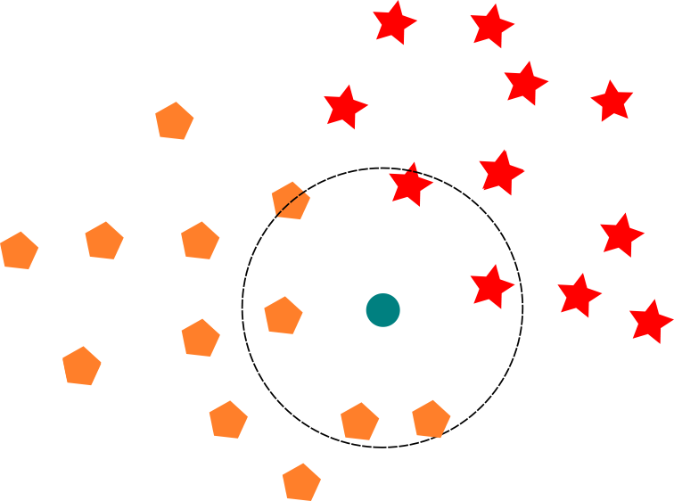

K-Nearest Neighbors (aka KNN) is one of the famous machine learning approaches. It's simple, intuitive and good tool to have on your machine learning toolbelt.

KNN is instance-based learning algorithm

## Intuition

As old saying goes, you are who you surround yourself with. This idea even has mathematical interpretation. In N-dimensional space, points that are closer to each other are more similar, then ones that stand apart. This is the assumption that KNN algorithm makes. It tries to find K nearest known points or samples, also called "neighbors", to some unknown sample. Majority class of neighbors defines class of the unknown sample.

Nearest neighbors defines class of unknown sample

To came from this idea to implementation, we need to define how to find closest points.

## Closest Points

We need to somehow measure distance between samples in order to find closest neighbors. There are turned out to be quite a few metrics we can use:

- Euclidean Distance - straight-line distance between two points
- Manhattan (City Block) Distance - distance between two points traversed in a along axises
- Minkowski Distance - Generalization of Euclidean and Manhattan distances
- scikit-learn supports <a target="_blank" rel="noopener nofollow" href="https://scikit-learn.org/stable/modules/generated/sklearn.neighbors.DistanceMetric.html#sklearn.neighbors.DistanceMetric">other metrics</a> as well

Distance metrics and their boundaries

Euclidean and Manhattan distances are the most popular. They are intuitive and fast to compute.

$$
a^2 + b^2 = c^2
$$

## References

- <a target="_blank" rel="noopener nofollow" href="https://www.oreilly.com/library/view/practical-statistics-for/9781491952955/">Practical Statistics for Data Scientists by Peter Bruce and Andrew Bruce</a>