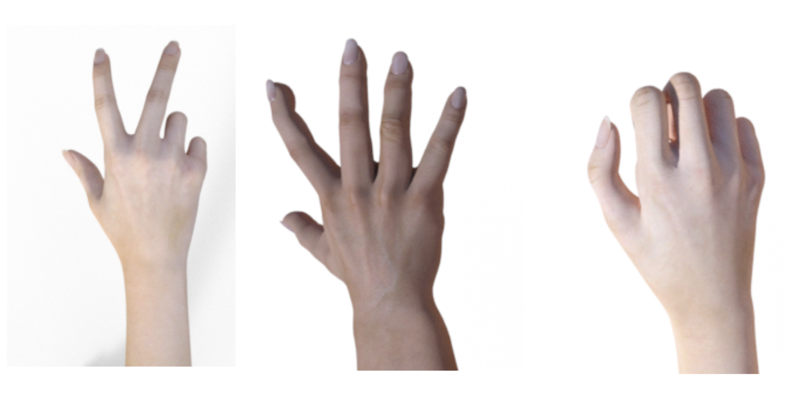
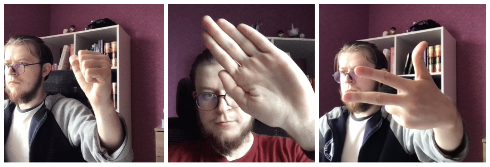
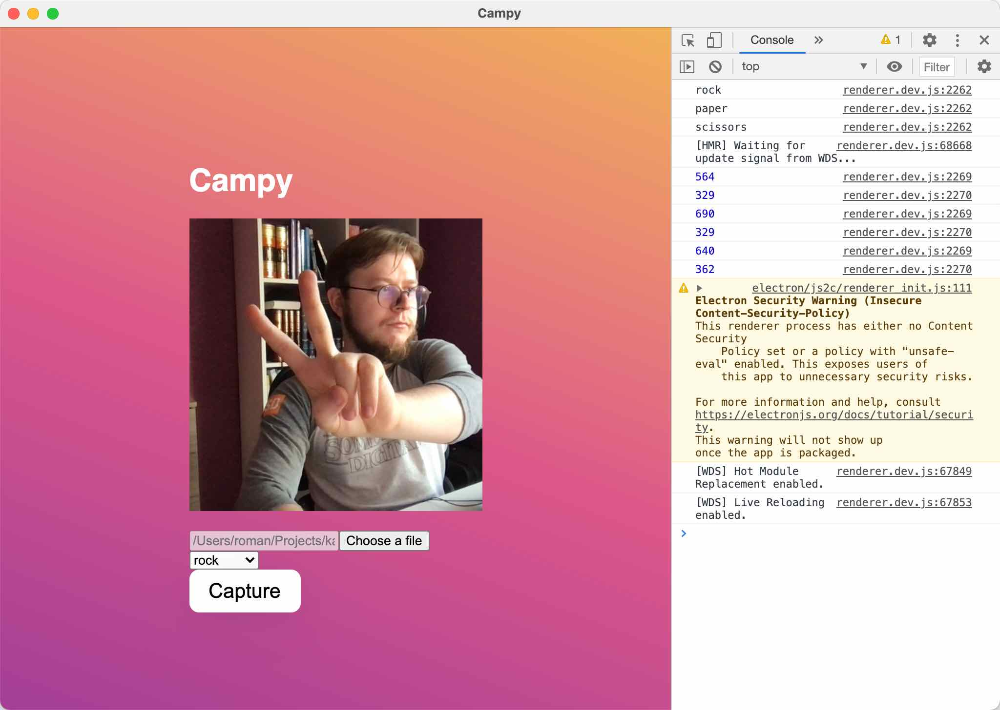
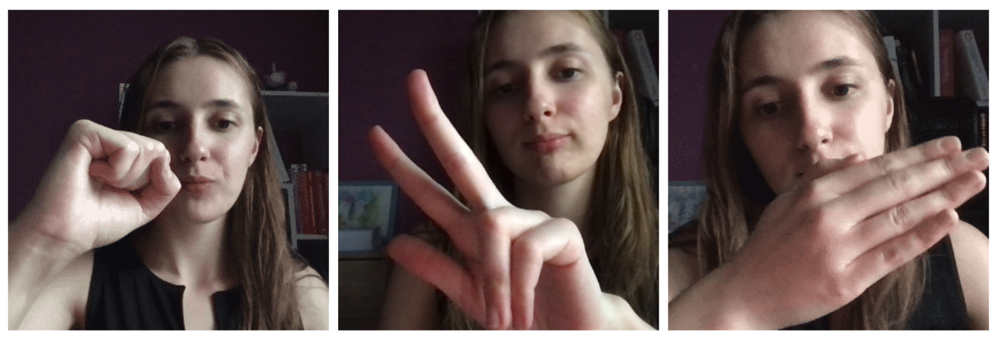

## More About Experiment

I hope you had a great time playing the game and now you are ready to understand what it took me to build it.

### Baseline

All machine learning experiments start with data. I wanted to find some open source datasets I would be able to use to build a quick baseline.

Fortunately, I could find a few datasets on Kaggle that seemed to match the goal. Namely, I picked:

- [frtgnn/rock-paper-scissor dataset](https://www.kaggle.com/frtgnn/rock-paper-scissor)

Here are how samples from the dataset look like:

Next, I chose a proper model architecture. I did not want to host my final model anywhere on an external server.

This requirement effectively left me with one single option: to use a small-size model and deploy it to my existing static website via [TensorFlow.js](https://www.tensorflow.org/js).

This thought process brought be to [the MobileNet model architecture](https://arxiv.org/abs/1704.04861).

MobileNet is a popular 2M+ params network that performs very well considering its relatively tiny size. Fortunately, TensorFlow supports a few versions of MobileNet trained on [the ImageNet dataset](https://www.image-net.org/). This meant that I was able to start training from the pretrained weights. It was actually good as it helped to reduce training time considerably and relaxed a need for large training dataset.

I wasn't the only one on the Internet who was thinking about this idea, so I was quickly able to a good notebook to build my baseline on:

- [trekhleb/rock-paper-scissors-mobilenet-v2 on Google Colab](https://colab.research.google.com/github/trekhleb/machine-learning-experiments/blob/master/experiments/rock_paper_scissors_mobilenet_v2/rock_paper_scissors_mobilenet_v2.ipynb)

Before doing any experiments I'd configured a few more things:

- configuration management with [Morty](https://github.com/roma-glushko/morty) which is my open source project to track ML/DL experiments
- experiment tracking with [Weights & Biases](https://wandb.com/)

todo: add more information about experiments and model architecture

The baseline had been successfully established, however, the results of the model was not that good. It made a lot of misclassifications and it was too early to use it.

### Collecting a Custom Dataset

On the possible reasons of that was the training dataset. I assumed that it's distributed differently than images I'd got from my webcam.

Besides possible differences in the hidden technical attributes of photos, my images had different composition. There were backgrounds, other parts of the body (not only one hand on the picture), different light conditions and things like that.

So I decided not to spend much time on trying fancy DL technics for gradient optimization or learning rate scheduling, but, instead, I started improving my dataset.

The goal was clear. I needed to take hundreds of images that would be as close as possible to what I expected my model to work with.

Turned out, it wasn't super easy. I had to group all of the images by classes (rock, paper, scissors). Also, I needed to track the number of images per each class to keep the distribution even among all classes. I needed some workflow to make it easy for me and possibly for other people that would decide to help me with this project.

After a bit of thinking, I had come up with the following project:

- https://github.com/roma-glushko/campy

Campy is an Electron-based desktop application that can simply take photos of the same size and put them to the right class folder:

The UI could have been sexier, but it'd done its job 😌

Having Campy in place helped me to streamline dataset building.

Another important thing is the test dataset. I chose to delegate this part to my girlfriend, so I would be more confident that my model was not learning how I looked like and would work with other people. Thankfully, girls like to take pictures, so I came with the right request:

As a result, we were able to collect:

- 360+ files per each class in the train dataset
- 260+ files per each class in the validation dataset
- 150+ files per each class in the test dataset

You can find the final dataset on Kaggle:

- https://www.kaggle.com/glushko/rock-paper-scissors-dataset

For training my model, I used not only images I had took but also the whole dataset I used to train my baseline model on.

### Fine-Tuning

The custom dataset helped quite a lot, but there were still a noticeable number of errors.

With my initial model architecture, there was merely one single dense layer that was training at that point. It wasn't really enough to gain a good accuracy in this task. So I went for fine-tuning of my MobileNet network.

I took the best configs I got at that point and started to unfreeze more and more layers starting from the end of the MobileNet feature extractor. With the RMSProp optimizer and 50 unfreezed layers, I was able to get 93% accuracy on my test dataset and to significantly reduce number of misclassifications which was a way more important for the game.

### Deployment

TBU

### Conclusions

TBU

## Resources

- https://github.com/roma-glushko/rock-paper-scissors
- https://www.kaggle.com/glushko/rock-paper-scissors-dataset